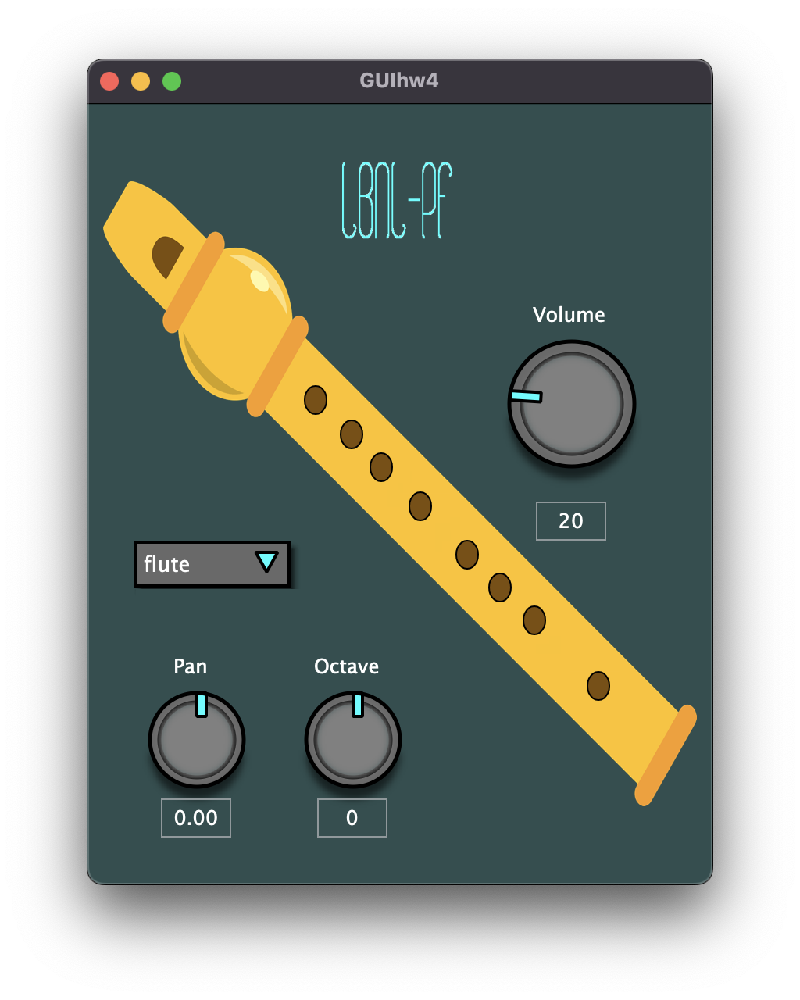
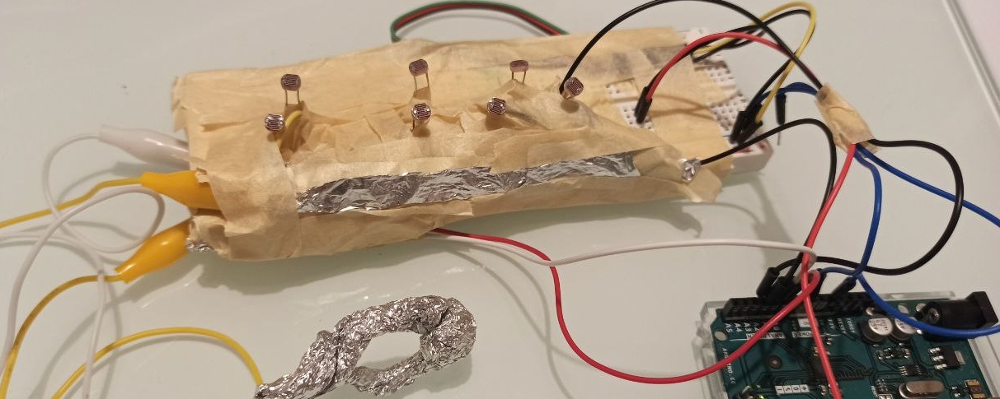

# group14-hw-ID-LastButNotLeast
Group 14 repository for the ID homework of CMLS 2022

## Last But Not Least - Components
- 10628467 - Riccardo Rossi
- 10834943 - Hou Hin Au Yeung
- 10679682 - Ferdinando Terminiello
- 10611785 - Francesco Piferi
- 10885119 - Mattia Massimi

## The Idea
 

**LBNL-PhotoFlute** is a JUCE + Supercollider + Arduino made application which let's you control a fully functioning flute controlled with photoresistors.

## How it Works

By placing your fingers on the various photoresistors and a peculiar sensor you can play notes on a GUI-customizable software instrument.

## Folder Structure

## Troubleshooting
